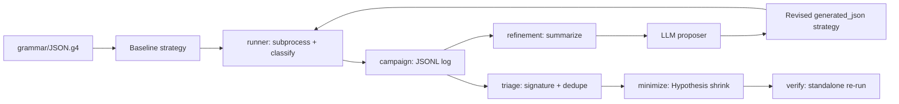

# Agentic Grammar Fuzzing

Black-box, grammar-seeded fuzzing of the [cJSON](https://github.com/DaveGamble/cJSON)
parser, driven by an LLM that turns a formal ANTLR grammar into a composable
[Hypothesis](https://hypothesis.readthedocs.io/) strategy and iteratively
refines it using feedback from previous runs — no coverage instrumentation,
only sanitizers and parser-level signal.

**Paper:** a full write-up of this project's methodology and results lives
under [`paper/`](paper/main.tex) (LaTeX source, ready to build in Overleaf or
locally) — see [Results so far](#results-so-far) below for the headline
numbers, or the paper itself for the full methodology, related work, and
discussion.

> **Self-initiated extension:** this repo also stands up a second,
> independent target ([parson](https://github.com/kgabis/parson)) and runs the
> full pipeline against it end-to-end, beyond the project's original scope.
> No LLM API key was used: each iteration's strategy was authored by hand in
> the proposer's role and then validated and executed through exactly the
> same `load_strategy`/`run_campaign` path a model's output would take. See
> [Bonus: a second target, run for real (parson)](#bonus-a-second-target-run-for-real-parson)
> for the full writeup: grammar-adaptation findings, five real campaigns,
> and an honestly-argued "why no crash" analysis.

## Contents

- [Agentic Grammar Fuzzing](#agentic-grammar-fuzzing)
  - [Contents](#contents)
  - [Overview](#overview)
  - [Target and grammar](#target-and-grammar)
  - [Pipeline](#pipeline)
  - [Repository layout](#repository-layout)
  - [Setup](#setup)
  - [Harness](#harness)
  - [Baseline campaign](#baseline-campaign)
  - [Agentic refinement loop](#agentic-refinement-loop)
  - [Repeated experiments and reproducibility](#repeated-experiments-and-reproducibility)
  - [Crash triage and minimization](#crash-triage-and-minimization)
  - [Testing](#testing)
  - [Results so far](#results-so-far)
  - [**Bonus: a second target, run for real (parson)**](#bonus-a-second-target-run-for-real-parson)
  - [Environment notes](#environment-notes)
  - [Citation](#citation)

## Overview

This project generates JSON documents from a grammar rather than random
bytes, feeds them through a sanitizer-instrumented build of cJSON, and closes
the loop with an LLM that reads back campaign statistics — acceptance rate,
structural diversity, rejection patterns, crash signatures — and proposes a
revised generator. The approach is intentionally **blackbox**: the only
feedback available is sanitizer output and the parser's own accept/reject
decision, so the design centers on choosing a proxy signal that approximates
what coverage instrumentation would otherwise provide.

## Target and grammar

| | |
|---|---|
| Library | [cJSON](https://github.com/DaveGamble/cJSON) |
| Pinned version | `v1.7.19` (commit `c859b25da02955fef659d658b8f324b5cde87be3`) |
| Format | JSON |
| Grammar source | [ANTLR grammars-v4 `JSON.g4`](https://github.com/antlr/grammars-v4/blob/master/json/JSON.g4), vendored at [grammar/JSON.g4](grammar/JSON.g4) |

The vendored source lives under [vendor/cjson](vendor/cjson) and is never
patched; the pinned commit is built as-is.

**Adaptations from the formal grammar to the library's real behavior:**

- The harness calls `cJSON_ParseWithLengthOpts(..., require_null_terminated=1)`,
  which rejects any input with trailing bytes after a valid value. The
  grammar's `json : value EOF ;` production already matches this, but
  cJSON's more commonly used `cJSON_Parse` entry point does *not* enforce
  full-buffer consumption — the harness deliberately picks the stricter
  variant so "accepted" means "the whole input is one grammar-valid value,"
  not "a prefix of it parsed."
- cJSON's number parsing has no way to produce `NaN` or `Infinity` (it
  explicitly rejects producing them when serializing), matching the
  grammar's `NUMBER` production; the strategies therefore exclude NaN/Infinity
  floats (`allow_nan=False, allow_infinity=False`) since the grammar has no
  token for them either.
- cJSON accepts duplicate object keys (it keeps every entry in an internal
  linked list rather than rejecting or de-duplicating), which the ANTLR
  grammar is silent on. The generators intentionally exercise duplicate keys
  since it is valid-but-underspecified territory, not a rejection case.

## Pipeline



1. **Harness** ([harness/cjson_harness.c](harness/cjson_harness.c)) reads stdin
   and calls the pinned cJSON parser, printing a one-line machine-readable
   result to stdout and reserving stderr for diagnostics/sanitizer reports.
2. **Runner** ([src/agentic_fuzzing/runner.py](src/agentic_fuzzing/runner.py))
   executes the harness as a bounded subprocess and classifies each run as
   `accepted`, `rejected`, `crash`, `timeout`, or `signal:<name>`.
3. **Campaign** ([src/agentic_fuzzing/campaign.py](src/agentic_fuzzing/campaign.py))
   drives a bounded stream of inputs through the runner and persists one JSON
   record per input, including a structural fingerprint used for diversity
   metrics.
4. **Refinement loop** ([src/agentic_fuzzing/refinement.py](src/agentic_fuzzing/refinement.py))
   summarizes each campaign, builds a prompt containing the grammar and the
   summary, sends it to an LLM proposer, validates and sandboxes the returned
   strategy ([src/agentic_fuzzing/proposal.py](src/agentic_fuzzing/proposal.py)),
   and runs the next campaign with it.
5. **Triage** ([src/agentic_fuzzing/triage.py](src/agentic_fuzzing/triage.py))
   normalizes sanitizer stack traces into a signature and groups crashes by
   root cause.
6. **Minimize** ([src/agentic_fuzzing/minimize.py](src/agentic_fuzzing/minimize.py))
   shrinks a failing input with Hypothesis's `find` while preserving its
   crash/timeout classification, then re-verifies the minimized input
   standalone.

## Repository layout

```text
grammar/       Formal JSON grammar used to seed and validate generators
harness/       C stdin adapter for the pinned cJSON parser
scripts/       Reproducible build and campaign entry points
src/           Python fuzzing package (runner, campaign, refinement, triage, minimize)
tests/         Unit and integration tests for every pipeline stage
vendor/cjson/  Pinned, unmodified cJSON source at the assigned commit
artifacts/     Logged campaign results and generated reports
```

## Setup

```sh
python3 -m venv .venv
source .venv/bin/activate
pip install -r requirements.txt
```

Versions are pinned because the deterministic-seeding shim is coupled to a
Hypothesis internal (see [Repeated experiments and reproducibility](#repeated-experiments-and-reproducibility)).
`openai` is only needed for the live refinement loop and `matplotlib` only for
figure generation; the pipeline and its tests need neither.

On macOS, also install Homebrew's LLVM so sanitizer builds don't hit Apple's
ASan startup deadlock (see [Environment notes](#environment-notes)):

```sh
brew install llvm
```

An `openai`-compatible client is only required if you use
[`OpenAIProposer`](src/agentic_fuzzing/llm.py) to drive the refinement loop
live; the loop itself accepts any `Callable[[str], str]` proposer, so tests
and offline runs use a stub instead.

## Harness

Build with sanitizers and smoke-test it against a couple of valid and invalid
inputs:

```sh
./scripts/build_target.sh
printf '{}' | ./build/cjson_harness      # status=accepted
printf '{]' | ./build/cjson_harness      # status=rejected offset=<n>
```

`scripts/build_target.sh` compiles `vendor/cjson/cJSON.c` and
`harness/cjson_harness.c` with `-fsanitize=address,undefined
-fno-omit-frame-pointer` by default. Set `SANITIZERS=none` to disable
sanitizers, or `SANITIZERS="..."` to override the flags entirely. On macOS the
script automatically builds with Homebrew's `clang` (`/opt/homebrew/opt/llvm`)
instead of Apple's, since Apple's ASan runtime deadlocks on this platform (see
[Environment notes](#environment-notes)); set `CC` explicitly to override.

## Baseline campaign

A first, intentionally naive strategy
([`baseline_json`](src/agentic_fuzzing/json_strategy.py)) generates
grammar-valid documents directly from `json_value` — a bounded
`st.recursive` combination of scalars, lists, and dictionaries — plus
`near_valid_json`, which appends a small malformed suffix to a valid document
to probe the boundary between accept and reject. This validates the full
pipeline (generate → serialize → run harness → classify → log) before any
LLM is involved:

```sh
PYTHONPATH=src .venv/bin/python scripts/run_baseline.py --examples 500
PYTHONPATH=src .venv/bin/python scripts/make_report.py artifacts/baseline.jsonl
```

## Agentic refinement loop

[`run_refinement_loop`](src/agentic_fuzzing/refinement.py) runs at most 5
iterations of 500 examples each (the project's fixed iteration and per-run
budget). Each iteration:

1. Builds a prompt containing the grammar text and a `CampaignSummary` of the
   previous iteration (outcome counts, unique input lengths, unique
   structural fingerprints, unique rejection signatures).
2. Sends the prompt to the proposer and requires the response to define a
   single `@st.composite def generated_json(draw) -> bytes` function using
   `st.recursive`/`@st.composite` for recursive structure.
3. Loads the proposal through [`load_strategy`](src/agentic_fuzzing/proposal.py),
   which parses the AST to reject disallowed imports (only
   `hypothesis.strategies` is permitted) and forbidden calls (`eval`, `exec`,
   `open`, `compile`, `__import__`), then sanity-checks that the strategy
   actually produces `bytes` via `.example()` before it is ever run against
   the target — a generator that fails this check never reaches the harness.
4. Runs the validated proposal through the same campaign/runner path as the
   baseline and persists the prompt, the raw proposal source, and the
   results for every iteration under `artifact_dir/iteration-N/`.
5. Feeds the resulting summary into the next iteration's prompt.

[`scripts/run_refinement.py`](scripts/run_refinement.py) wires this up against
the pinned cJSON harness with a real [`OpenAIProposer`](src/agentic_fuzzing/llm.py):

```sh
export OPENAI_API_KEY=sk-...
PYTHONPATH=src .venv/bin/python scripts/run_refinement.py
PYTHONPATH=src .venv/bin/python scripts/make_loop_report.py \
    artifacts/repeated/cjson-loop/run-01-seed-0000
```

It persists five iterations of at most 500 examples each under
`<artifact-dir>/run-NN-seed-SSSS/iteration-N/` (`prompt.txt`, `proposal.py`,
`results.jsonl`, and `proposal_error.txt` when a proposal is rejected), which
mirrors the [parson bonus run](#bonus-a-second-target-run-for-real-parson)'s
`artifacts/parson-loop` layout one level down, so the two targets' iteration
tables are directly comparable via the same
[`scripts/make_loop_report.py`](scripts/make_loop_report.py) — point it at a run
directory for a repeated run, or at `artifacts/cjson-loop` for the committed
official run. Running it requires an `OPENAI_API_KEY` with API access; none is
bundled with this repo.

**Proxy signal.** With no coverage instrumentation, refinement is steered by
three observable, parser-level proxies instead:

- **Acceptance rate** (`accepted` vs `rejected` vs `crash`/`timeout`) — a
  generator accepted near 0% of the time is testing the rejection path only,
  not the parser's structural handling, and is flagged for correction.
- **Structural diversity** — the number of distinct shape fingerprints
  (`{`, `}`, `[`, `]`, `:`, `,`, digit, string-quote, whitespace, other,
  computed by [`_structure`](src/agentic_fuzzing/campaign.py)) seen across a
  campaign, used as a cheap proxy for "how many different grammar shapes has
  this generator actually produced" absent real coverage data.
- **Rejection signatures** — the distinct parser rejection messages/offsets
  seen, used to tell the LLM which malformed shapes are already well covered
  versus unexplored.

These three numbers are the entire feedback signal handed back to the LLM
each iteration; the prompt explicitly asks it to steer away from
mostly-rejected productions and toward structurally novel, deeply nested, or
previously-uncrashed shapes.

## Repeated experiments and reproducibility

The single official runs above are preserved unchanged under
`artifacts/cjson-loop` and `artifacts/parson-loop`. Repeated, seeded
experiments write to a separate tree so those cited artifacts can never be
overwritten. The final baseline-vs-refined comparison cited in
[Results so far](#results-so-far) is one instance of this: `artifacts/final/`
uses this exact `run-NN-seed-SSSS/` layout, just under a name that reflects
its role (the cited comparison) rather than the generic `repeated/` path
used for exploratory reruns:

```text
artifacts/repeated/<experiment>/
  run-01-seed-0000/
    manifest.json           seed, versions, platform, model, feedback mode, arguments
    iteration-N/            prompt.txt, proposal.py, results.jsonl, summary.json,
                            and proposal_error.txt if the proposal was rejected
  reproducibility.{json,md} environment provenance for the whole experiment
  aggregate.{csv,json}      per-run metrics plus mean/sd/min/max
  comparison.{csv,md}       written into the *refined* arm by compare_experiments.py
  figures/                  acceptance_rate_per_iteration,
                            structural_fingerprints_per_iteration,
                            rejection_signatures_per_iteration,
                            acceptance_rate_across_runs (each as .png and .pdf)
```

The single-file baseline path (`--output` without `--artifact-dir`) writes
`<output>.jsonl` plus `<output>.manifest.json` and
`<output>.reproducibility.{json,md}` beside it, and
[`scripts/make_report.py`](scripts/make_report.py) turns a JSONL into
`artifacts/report.md` by default.

```sh
# refined arm (needs OPENAI_API_KEY); baseline arm needs no key
PYTHONPATH=src .venv/bin/python scripts/run_refinement.py \
    --artifact-dir artifacts/repeated/cjson-loop --runs 5 --seed 0
PYTHONPATH=src .venv/bin/python scripts/run_baseline.py \
    --artifact-dir artifacts/repeated/cjson-baseline --runs 5 --examples 500 --seed 0

.venv/bin/python scripts/aggregate_runs.py      artifacts/repeated/cjson-loop
.venv/bin/python scripts/make_figures.py        artifacts/repeated/cjson-loop
.venv/bin/python scripts/compare_experiments.py artifacts/repeated/cjson-baseline \
                                                artifacts/repeated/cjson-loop
```

Run *N* uses seed `--seed + N - 1`. A run directory that already holds results
is refused unless `--overwrite` is passed, which deletes and recreates it so a
shorter re-run cannot leave a previous run's extra iterations behind. The
analysis scripts read only `summary.json`, `manifest.json`, and
`aggregate.json` — never `results.jsonl` — and none of them import the fuzzing
engine. Re-run `aggregate_runs.py` before `make_figures.py` or
`compare_experiments.py` after any new run, since both prefer an existing
`aggregate.json` when one is present.

**Ablation over the feedback signal.** `--feedback` selects which campaign
metrics the prompt exposes: `counts` (outcome counts and total only),
`counts+rejections` (adds `unique_rejections`), or `full` (the default and the
behaviour used for every result reported here). Only the prompt's metrics
object changes; the loop, the campaign, and the proposer are untouched, and the
selected mode is recorded in each `manifest.json` and reproducibility report.

**How the reported numbers are defined.** Acceptance rate is
`accepted / total`, whose denominator includes inputs that failed to encode and
never reached the parser; the crash column counts every outcome that is neither
accepted, rejected nor an encoding error, so timeouts and signals are included;
and per-run fingerprint and signature counts are summed over a run's
iterations, making them upper bounds rather than de-duplicated totals. These
are the same conventions as [`scripts/make_loop_report.py`](scripts/make_loop_report.py),
so the aggregate tables and the per-iteration tables above are comparable.

**How seeding works, and what it does not cover.** `.example()` draws its
randomness from a private Hypothesis global that `random.seed()` does not
reach, and then selects from its batch using the module-level `random.shuffle`.
Measured on Hypothesis 6.165.5 / CPython 3.14.7, seeding either one alone
leaves the example stream non-reproducible across processes; seeding both
([`seeding.seed_everything`](src/agentic_fuzzing/seeding.py)) makes it
byte-identical. In a small check (8 draws, repeated across processes) seeding
did not reduce the number of distinct values drawn — 8/8 unique seeded versus
7/8 unseeded — which guards against the generator collapsing but is not a
measurement of the draw distribution. The documented
alternatives (`settings(derandomize=True)`, `global_force_seed`) were rejected
because both collapse 500 draws into repeats of a single batch of 10, which
would change the fuzzing algorithm rather than just fix its starting point.
Because this relies on a Hypothesis internal, the version is pinned and the
shim fails loudly if the attribute disappears.

Reproducibility is therefore scoped to the *generated input stream*. It does
not extend to: LLM proposals (`temperature=0.2`, no seed, server-side model
drift — so a seeded refined run is reproducible given the same proposal
source, not end to end); `timeout` classification, which is wall-clock and
load dependent; or the harness binary, which is gitignored and host-compiled,
and is therefore identified by SHA-256 in each reproducibility report.

## Crash triage and minimization

- **Detection** ([`runner.run_input`](src/agentic_fuzzing/runner.py)):
  a run is a `crash` if the process is killed by a fatal signal or if
  `AddressSanitizer`/`UndefinedBehaviorSanitizer` text appears in stderr; a
  `timeout` is recorded separately and is treated as a crash for triage and
  grading purposes (a hang is a denial-of-service bug, not a benign case).
- **Capture**: every record in the campaign JSONL keeps the exact input
  (hex-encoded), full stdout/stderr, and return code/signal.
- **Deduplication** ([`triage.sanitizer_signature`](src/agentic_fuzzing/triage.py)):
  sanitizer reports are reduced to their `SUMMARY:` line and stack frames,
  with addresses and source line numbers normalized out, then hashed to a
  16-character `crash_id`. Records sharing a `crash_id` are the same root
  cause.
- **Minimization** ([`minimize.minimize_input`](src/agentic_fuzzing/minimize.py)):
  for each unique signature, Hypothesis's `find` shrinks the triggering input
  to a minimal byte string that still reproduces the same crash/timeout
  classification (rather than keeping the first crash observed).
- **Verification** ([`minimize.verify_reproducer`](src/agentic_fuzzing/minimize.py)):
  the minimized input is re-run once, standalone, against the pinned build
  before being reported.

## Testing

```sh
./scripts/build_target.sh
PYTHONPATH=src .venv/bin/pytest -q
```

Tests cover every pipeline stage independently: `runner` classification
(crash/timeout), `campaign` bounding and persistence, `proposal` sandboxing
of LLM-returned code, `refinement` prompt construction and loop execution,
`triage` signature normalization, `minimize` shrinking, and the JSON
strategies and report generator.

## Results so far

**Final result: a seeded, 15-run-per-arm comparison of the baseline
generator against the LLM-refined loop**, both run against the pinned cJSON
build with `-fsanitize=address,undefined` and `gpt-4.1-mini` as the proposer
(full data in
[artifacts/repeated/cjson-refined-n15/comparison.md](artifacts/repeated/cjson-refined-n15/comparison.md),
per-run detail under
[artifacts/repeated/cjson-baseline-n15](artifacts/repeated/cjson-baseline-n15)
and [artifacts/repeated/cjson-refined-n15](artifacts/repeated/cjson-refined-n15)):

| Metric | Baseline (n = 15) | Refined (n = 15) | Change |
|---|---:|---:|---:|
| Acceptance rate | 58.21% | 97.07% | +38.86 pp (+66.8%) |
| Structural fingerprints (sum/run, mean) | 274.5 | 598.2 | descriptive only\* |
| Rejection signatures (sum/run, mean) | 87.8 | 24.1 | descriptive only\* |
| Sanitizer crashes / timeouts / signals | 0 | 0 | — |

\* fingerprint and rejection-signature totals scale with each arm's total
executed inputs, which differ between arms (500 vs. ~1,533 on average), so
they are reported as descriptive sums rather than tested effects.

Fifteen independent runs per arm (seeds 0-14), each up to five refinement
iterations of up to 500 examples. All fifteen refined-arm runs exceed all
fifteen baseline-arm runs on acceptance rate — complete rank separation,
giving an exact two-sided permutation p = 2/C(30,15) ≈ 1.29e-8 for this
scale-free metric specifically (not claimed for the two count-based rows,
which are descriptive and not tested). Every run's manifest, reproducibility
report, and aggregate/comparison output are under
`artifacts/repeated/cjson-{baseline,refined}-n15/`. No crashes were found in
either arm — the measured effect is that LLM-guided refinement reliably
steers the generator toward grammar-valid input, not toward a memory-safety
bug in cJSON specifically (see the
[parson bonus](#bonus-a-second-target-run-for-real-parson) below for where
this pipeline did go looking for one).

This extends an initial five-run-per-arm pilot
([artifacts/final/comparison.md](artifacts/final/comparison.md), 57.64% ->
96.77%, `n=5`) to a larger sample; the pilot is superseded by the table
above as the paper's reported result but is kept as-is for provenance —
it is the version archived at the project's Zenodo DOI.

Reproduce the fifteen-run comparison with:

```sh
PYTHONPATH=src .venv/bin/python scripts/run_baseline.py \
    --artifact-dir artifacts/repeated/cjson-baseline-n15 --runs 15 --examples 500 --seed 0
PYTHONPATH=src .venv/bin/python scripts/run_refinement.py \
    --artifact-dir artifacts/repeated/cjson-refined-n15 --runs 15 --iterations 5 \
    --examples 500 --seed 0 --model gpt-4.1-mini
.venv/bin/python scripts/aggregate_runs.py artifacts/repeated/cjson-baseline-n15
.venv/bin/python scripts/aggregate_runs.py artifacts/repeated/cjson-refined-n15
.venv/bin/python scripts/compare_experiments.py \
    artifacts/repeated/cjson-baseline-n15 artifacts/repeated/cjson-refined-n15
.venv/bin/python scripts/make_paper_figure.py \
    --baseline-dir artifacts/repeated/cjson-baseline-n15 \
    --refined-dir artifacts/repeated/cjson-refined-n15
```

### Feedback-signal ablation

Which of the three coverage-free proxies actually drives the acceptance-rate
improvement? Re-running the refined arm under three feedback modes (five
seeded trials each, seeds 0-4 against the same cJSON build) isolates this
(full data under
[artifacts/repeated/ablation-full/comparison.md](artifacts/repeated/ablation-full/comparison.md)
and the sibling `ablation-counts{,-rejections}/` directories):

| Feedback mode | Acceptance rate (usable trials) | Fingerprints (sum/run) | Rejection sigs (sum/run) |
|---|---:|---:|---:|
| `counts` | 92.58% (4 of 5) | 505.5 | 6.5 |
| `counts+rejections` | 96.42% (4 of 5) | 457.3 | 26.8 |
| `full` | 95.53% (4 of 5) | 503.5 | 34.8 |

In each mode, one of the five trials produced no sandbox-valid LLM proposal
across all five iterations (`iterations_with_data == 0` in `aggregate.json`)
and is excluded, leaving four usable trials per mode. All three modes reach
a similar, near-ceiling acceptance rate — descriptively, `counts` alone
looks close to sufficient for that objective on its own — but
rejection-signature diversity increases with how much of the signal the
proposer sees, roughly 5x higher under `full` than under `counts` alone.
At four trials per condition this is reported descriptively, not as a
tested effect (no separation between modes' acceptance rates).

Reproduce with:

```sh
PYTHONPATH=src .venv/bin/python scripts/run_refinement.py \
    --artifact-dir artifacts/repeated/ablation-counts --runs 5 --iterations 5 \
    --examples 500 --seed 0 --model gpt-4.1-mini --feedback counts
PYTHONPATH=src .venv/bin/python scripts/run_refinement.py \
    --artifact-dir artifacts/repeated/ablation-counts-rejections --runs 5 --iterations 5 \
    --examples 500 --seed 0 --model gpt-4.1-mini --feedback counts+rejections
PYTHONPATH=src .venv/bin/python scripts/run_refinement.py \
    --artifact-dir artifacts/repeated/ablation-full --runs 5 --iterations 5 \
    --examples 500 --seed 0 --model gpt-4.1-mini --feedback full
.venv/bin/python scripts/aggregate_runs.py artifacts/repeated/ablation-counts
.venv/bin/python scripts/aggregate_runs.py artifacts/repeated/ablation-counts-rejections
.venv/bin/python scripts/aggregate_runs.py artifacts/repeated/ablation-full
```

**Earlier sanity-check campaigns.** Before this final comparison, small
20-input campaigns (see [artifacts/final-report.md](artifacts/final-report.md),
[artifacts/baseline.jsonl](artifacts/baseline.jsonl), and
[artifacts/final-baseline.jsonl](artifacts/final-baseline.jsonl)) validated
that the pipeline runs end to end (11/20 and 13/20 accepted, no crash
signatures) before the LLM was ever wired in. They predate and are superseded
by the table above; kept for provenance, not as a result to draw conclusions
from.

## Bonus: a second target, run for real (parson)

> **This section goes beyond the project's original scope.** Everything
> above stands on its own. What follows is additional, self-initiated work: a
> second pinned target, a second harness, and five real (not simulated)
> agentic-loop iterations, run specifically to see whether this pipeline
> could turn up an actual memory-safety bug beyond the core deliverable.

A trial run on [parson](https://github.com/kgabis/parson) (JSON) was reported
elsewhere to go from 0 crashes to reliable crashes within 5 agentic-loop
iterations. As a self-initiated extension, this repo stands up parson as a
second target, reusing
every pipeline component unchanged (`runner`, `campaign`, `proposal`,
`refinement`, `triage`, `minimize` are all format/target-agnostic — only a
new harness and build script were needed), and runs the real refinement loop
against it, with no LLM API key required: each iteration's strategy was
authored directly by reasoning over the campaign summary and the target's
source, in exactly the role `OpenAIProposer` would otherwise play, then
validated through the same `load_strategy` sandbox and executed through the
same `run_campaign`/`run_refinement_loop` code path as a real proposer's
output would be.

| | |
|---|---|
| Library | [parson](https://github.com/kgabis/parson) |
| Pinned commit | `ba29f4eda9ea7703a9f6a9cf2b0532a2605723c3` (`1.5.3`) |
| Harness | [harness/parson_harness.c](harness/parson_harness.c) |
| Build | [scripts/build_parson.sh](scripts/build_parson.sh) |
| Vendored source | [vendor/parson](vendor/parson) |

**Grammar adaptations discovered (not read from parson's source ahead of
time — found empirically and confirmed by inspection afterward):**

- **Superset:** unlike this project's cJSON harness (which uses
  `require_null_terminated=1`), `json_parse_string` does **not** require the
  whole buffer to be consumed — `{} trailing garbage` is accepted, parsing
  only the leading `{}` and silently ignoring the rest. The grammar's
  `json : value EOF ;` production is not enforced by parson's real API.
- **Subset:** parson's `json_object_add` explicitly rejects any object
  containing a repeated key (`if (found) return JSONFailure;`), which
  propagates up as a parse failure for the whole object. The ANTLR grammar
  is silent on duplicate keys (unlike cJSON, which accepts them) — so the
  same JSON text can be valid for one pinned library and rejected by another,
  which is exactly the kind of gap Step 1 asks to document.
- parson enforces `MAX_NESTING = 2048` for `{`/`[` nesting during parsing,
  independent of any harness-side limit — deeper structures are rejected,
  not stack-overflowed.

**Iterations run** (five real campaigns of 500 examples each against
`build/parson_harness`, full logs and generators under
[artifacts/parson-loop](artifacts/parson-loop)):

| Iteration | Focus | Outcome | Structural fingerprints |
|---|---|---|---|
| [1](artifacts/parson-loop/iteration-1) | Grammar-seeded generator: recursive JSON values, numeric edge cases (huge exponents, `-0`, 400-digit integers), escape/surrogate edge cases, duplicate keys, trailing garbage | 285 accepted / 215 rejected, 0 crashes | 206/500 |
| [2](artifacts/parson-loop/iteration-2) | Iteration 1 never produced objects/arrays past 6 elements, so `json_object_grow_and_rehash`/array-resize (triggered at >11 keys, `STARTING_CAPACITY=16`) was never exercised; this iteration adds wide objects/arrays up to 4000 unique keys/elements | 341 accepted / 159 rejected, 0 crashes | 273/500 |
| [3](artifacts/parson-loop/iteration-3) | Targets hash-bucket collisions (shared-prefix keys), combined wide+deep structures, and surrogate-escape sequences positioned exactly at a string's closing quote (the boundary between `parse_utf16`'s raw pointer walk and `process_string`'s length tracking) | 442 accepted / 58 rejected, 0 crashes | 254/500 |
| [4](artifacts/parson-loop/iteration-4) | Iterations 1-3 only ever freed fully-valid documents via the harness's single top-level `json_value_free`; this iteration targets parson's *internal* error-cleanup free path instead — deep chains/wide, multiply-rehashed objects that are valid until the very last token (a missing final bracket, or a duplicate key appended after many unique ones), forcing `parse_object_value`/`parse_array_value` to free the whole built subtree from inside their own failure branches | 85 accepted / 415 rejected (deliberately low — most inputs are designed to fail at the very end), 0 crashes | 214/500 |
| [5](artifacts/parson-loop/iteration-5) | Combines iteration 4's two free-path shapes (deep chain **and** wide rehashed object failing together in one unwind) and adds a sibling-cascade case — an array of several already-built, structurally diverse children (deep/wide/long-string) followed by one duplicate-keyed object, so the whole array frees all its live siblings in one recursive call — plus duplicate keys planted at a randomly chosen array/object depth | 139 accepted / 361 rejected, 0 crashes | 302/500 |

Each iteration's `proposal.py` is a self-contained Hypothesis strategy built
only from `st.*` combinators and string operators/methods — not
`json.dumps`-then-serialize — as a style choice for the hand-authored
proposer role, not a sandbox constraint: `proposal.py`'s validator
([`load_strategy`](src/agentic_fuzzing/proposal.py)) is a *blocklist*, not a
whitelist — it AST-checks that the only import is `hypothesis.strategies`
and that none of `eval`/`exec`/`open`/`compile`/`__import__` are called, then
runs the proposal with every ordinary builtin available (`ord`, `chr`, `str`,
`len`, `range`, ... are all present) except a short list of dangerous
entry points (`eval`, `exec`, `compile`, `__import__`, `open`, `input`,
`breakpoint`, `exit`, `quit`, `help`, `globals`, `locals`, `vars`,
`getattr`, `setattr`, `delattr`). The code documents its own threat model
honestly: this is a filter against *accidental* misuse of untrusted
LLM-authored code, not a hardened security boundary — Python's object model
can still reach dangerous functionality without naming any blocked builtin
(e.g. walking `().__class__.__base__.__subclasses__()`), and closing that off
for real would require process- or container-level isolation, not name
filtering. (An earlier whitelist-based version of this sandbox did strip
ordinary builtins and would have produced exactly the `NameError` failure
mode described in an earlier draft of this section; it was replaced with the
current blocklist before the parson runs below, since whitelisting
individual "safe" names turned into unbounded whack-a-mole against ordinary
Python.)

**Result: no crash found across 3,000 real sanitizer-instrumented runs**
(500 baseline + 5 × 500 agentic iterations, all built with
`-fsanitize=address,undefined`) — confirmed by grepping every run's stderr
for `AddressSanitizer`/`UndefinedBehaviorSanitizer`/`LeakSanitizer` text and
checking for any non-`accepted`/`rejected` status (no `crash`, `timeout`, or
`signal:*` ever appeared, including across iterations 4-5's deliberate stress
of the internal error-cleanup free path). Manual source review of the
highest-risk paths (`parse_utf16`'s raw pointer walk across surrogate pairs,
`process_string`'s output-buffer sizing, `json_object_grow_and_rehash`'s
linear probing, and — informed by iterations 4-5 — `json_object_add`'s
duplicate-key failure branch and `parse_object_value`/`parse_array_value`'s
missing-bracket failure branch) found that every one of them relies on
hitting the harness's own null terminator as a safe, in-bounds stopping
condition, and that the internal cleanup calls to `json_value_free` are
consistent with the harness's own top-level call (the object's `count` is
never incremented before a duplicate is detected, so `json_object_deinit`
never iterates past the last successfully-added slot) — a defensible, if
unglamorous, explanation for why targeted structural fuzzing within this
budget, including five full agentic iterations split across both the parse
and free paths, did not surface a memory-safety bug in this particular
pinned commit. In keeping with a policy against fabricating a crash or
silently pushing past 5 iterations, this bonus run stops here. What's next
with more budget: (1) drive `json_value_free` through the public mutation
API (`json_object_remove`/`json_array_remove`/`_replace_*`) rather than only
the parse-then-free path the black-box harness can reach, and (2) if still
nothing, try one of the less-audited libraries (`inih`, `libcsv`) where a
first pass is more likely to find something.

## Environment notes

- **macOS ASan deadlock, worked around.** Apple's clang 17/ASan (Xcode 17,
  macOS 26) deadlocks on startup on Apple Silicon — confirmed with a native
  stack sample ([test_asan.c](test_asan.c) as the minimal repro) showing
  `AsanInitFromRtl()` spinning forever on `StaticSpinMutex::LockSlow()`
  because shadow-memory setup (`dyld_shared_cache_iterate_text_swift`)
  triggers a re-entrant `malloc` while the init lock is already held — a bug
  in Apple's compiler-rt, not in this project. [scripts/build_target.sh](scripts/build_target.sh)
  works around it by preferring Homebrew's `clang` (`brew install llvm`) on
  macOS, whose independently-built ASan runtime does not hit this deadlock.
  With that toolchain, the harness, baseline campaign, and test suite all run
  cleanly with real `-fsanitize=address,undefined` on this host; Linux and
  stock Xcode toolchains are unaffected and need no workaround.
- The `OpenAIProposer` in [src/agentic_fuzzing/llm.py](src/agentic_fuzzing/llm.py)
  is a thin, swappable adapter; the refinement loop itself has no dependency
  on a specific LLM provider and is fully exercised in tests with a
  deterministic stub proposer.

## Citation

[](https://doi.org/10.5281/zenodo.22231289)

If you use this repository, please cite the archived release
(see also [`CITATION.cff`](CITATION.cff)):

```bibtex
@software{mansy2026agentic,
  author  = {Mansy, Ziyad},
  title   = {{Agentic Grammar Fuzzing: LLM-Guided Grammar Refinement for Parser Testing}},
  year    = {2026},
  version = {1.0.0},
  doi     = {10.5281/zenodo.22231289},
  url     = {https://github.com/ziyadmansy/agentic-grammar-fuzzing}
}
```

---

**Author:** Ziyad Mohammad Mansy Ibrahim — ziyadmohammad37@gmail.com — [GitHub](https://github.com/ziyadmansy) · [LinkedIn](https://www.linkedin.com/in/ziyadmansy/)
