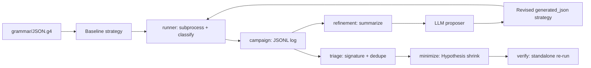

# Agentic Grammar Fuzzing

Black-box, grammar-seeded fuzzing of the [cJSON](https://github.com/DaveGamble/cJSON)
parser, driven by an LLM that turns a formal ANTLR grammar into a composable
[Hypothesis](https://hypothesis.readthedocs.io/) strategy and iteratively
refines it using feedback from previous runs — no coverage instrumentation,
only sanitizers and parser-level signal.

## Contents

- [Agentic Grammar Fuzzing](#agentic-grammar-fuzzing)
  - [Contents](#contents)
  - [Overview](#overview)
  - [Target and grammar](#target-and-grammar)
  - [Pipeline](#pipeline)
  - [Repository layout](#repository-layout)
  - [Setup](#setup)
  - [Harness](#harness)
  - [Baseline campaign](#baseline-campaign)
  - [Agentic refinement loop](#agentic-refinement-loop)
  - [Crash triage and minimization](#crash-triage-and-minimization)
  - [Testing](#testing)
  - [Results so far](#results-so-far)
  - [Known limitations](#known-limitations)

## Overview

This project generates JSON documents from a grammar rather than random
bytes, feeds them through a sanitizer-instrumented build of cJSON, and closes
the loop with an LLM that reads back campaign statistics — acceptance rate,
structural diversity, rejection patterns, crash signatures — and proposes a
revised generator. The approach is intentionally **blackbox**: the only
feedback available is sanitizer output and the parser's own accept/reject
decision, so the design centers on choosing a proxy signal that approximates
what coverage instrumentation would otherwise provide.

## Target and grammar

| | |
|---|---|
| Library | [cJSON](https://github.com/DaveGamble/cJSON) |
| Pinned version | `v1.7.19` (commit `c859b25da02955fef659d658b8f324b5cde87be`) |
| Format | JSON |
| Grammar source | [ANTLR grammars-v4 `JSON.g4`](https://github.com/antlr/grammars-v4/blob/master/json/JSON.g4), vendored at [grammar/JSON.g4](grammar/JSON.g4) |

The vendored source lives under [vendor/cjson](vendor/cjson) and is never
patched; the pinned commit is built as-is.

**Adaptations from the formal grammar to the library's real behavior:**

- The harness calls `cJSON_ParseWithLengthOpts(..., require_null_terminated=1)`,
  which rejects any input with trailing bytes after a valid value. The
  grammar's `json : value EOF ;` production already matches this, but
  cJSON's more commonly used `cJSON_Parse` entry point does *not* enforce
  full-buffer consumption — the harness deliberately picks the stricter
  variant so "accepted" means "the whole input is one grammar-valid value,"
  not "a prefix of it parsed."
- cJSON's number parsing has no way to produce `NaN` or `Infinity` (it
  explicitly rejects producing them when serializing), matching the
  grammar's `NUMBER` production; the strategies therefore exclude NaN/Infinity
  floats (`allow_nan=False, allow_infinity=False`) since the grammar has no
  token for them either.
- cJSON accepts duplicate object keys (it keeps every entry in an internal
  linked list rather than rejecting or de-duplicating), which the ANTLR
  grammar is silent on. The generators intentionally exercise duplicate keys
  since it is valid-but-underspecified territory, not a rejection case.

## Pipeline



1. **Harness** ([harness/cjson_harness.c](harness/cjson_harness.c)) reads stdin
   and calls the pinned cJSON parser, printing a one-line machine-readable
   result to stdout and reserving stderr for diagnostics/sanitizer reports.
2. **Runner** ([src/agentic_fuzzing/runner.py](src/agentic_fuzzing/runner.py))
   executes the harness as a bounded subprocess and classifies each run as
   `accepted`, `rejected`, `crash`, `timeout`, or `signal:<name>`.
3. **Campaign** ([src/agentic_fuzzing/campaign.py](src/agentic_fuzzing/campaign.py))
   drives a bounded stream of inputs through the runner and persists one JSON
   record per input, including a structural fingerprint used for diversity
   metrics.
4. **Refinement loop** ([src/agentic_fuzzing/refinement.py](src/agentic_fuzzing/refinement.py))
   summarizes each campaign, builds a prompt containing the grammar and the
   summary, sends it to an LLM proposer, validates and sandboxes the returned
   strategy ([src/agentic_fuzzing/proposal.py](src/agentic_fuzzing/proposal.py)),
   and runs the next campaign with it.
5. **Triage** ([src/agentic_fuzzing/triage.py](src/agentic_fuzzing/triage.py))
   normalizes sanitizer stack traces into a signature and groups crashes by
   root cause.
6. **Minimize** ([src/agentic_fuzzing/minimize.py](src/agentic_fuzzing/minimize.py))
   shrinks a failing input with Hypothesis's `find` while preserving its
   crash/timeout classification, then re-verifies the minimized input
   standalone.

## Repository layout

```text
grammar/       Formal JSON grammar used to seed and validate generators
harness/       C stdin adapter for the pinned cJSON parser
scripts/       Reproducible build and campaign entry points
src/           Python fuzzing package (runner, campaign, refinement, triage, minimize)
tests/         Unit and integration tests for every pipeline stage
vendor/cjson/  Pinned, unmodified cJSON source at the assigned commit
artifacts/     Logged campaign results and generated reports
```

## Setup

```sh
python3 -m venv .venv
source .venv/bin/activate
pip install hypothesis pytest
```

An `openai`-compatible client is only required if you use
[`OpenAIProposer`](src/agentic_fuzzing/llm.py) to drive the refinement loop
live; the loop itself accepts any `Callable[[str], str]` proposer, so tests
and offline runs use a stub instead.

## Harness

Build with sanitizers and smoke-test it against a couple of valid and invalid
inputs:

```sh
./scripts/build_target.sh
printf '{}' | ./build/cjson_harness      # status=accepted
printf '{]' | ./build/cjson_harness      # status=rejected offset=<n>
```

`scripts/build_target.sh` compiles `vendor/cjson/cJSON.c` and
`harness/cjson_harness.c` with `-fsanitize=address,undefined
-fno-omit-frame-pointer` by default. Set `SANITIZERS=none` to disable
sanitizers, or `SANITIZERS="..."` to override the flags entirely.

## Baseline campaign

A first, intentionally naive strategy
([`baseline_json`](src/agentic_fuzzing/json_strategy.py)) generates
grammar-valid documents directly from `json_value` — a bounded
`st.recursive` combination of scalars, lists, and dictionaries — plus
`near_valid_json`, which appends a small malformed suffix to a valid document
to probe the boundary between accept and reject. This validates the full
pipeline (generate → serialize → run harness → classify → log) before any
LLM is involved:

```sh
PYTHONPATH=src .venv/bin/python scripts/run_baseline.py --examples 500
PYTHONPATH=src .venv/bin/python scripts/make_report.py artifacts/baseline.jsonl
```

## Agentic refinement loop

[`run_refinement_loop`](src/agentic_fuzzing/refinement.py) runs at most 5
iterations of 500 examples each (matching the assignment's iteration and
per-run bounds). Each iteration:

1. Builds a prompt containing the grammar text and a `CampaignSummary` of the
   previous iteration (outcome counts, unique input lengths, unique
   structural fingerprints, unique rejection signatures).
2. Sends the prompt to the proposer and requires the response to define a
   single `@st.composite def generated_json(draw) -> bytes` function using
   `st.recursive`/`@st.composite` for recursive structure.
3. Loads the proposal through [`load_strategy`](src/agentic_fuzzing/proposal.py),
   which parses the AST to reject disallowed imports (only
   `hypothesis.strategies` is permitted) and forbidden calls (`eval`, `exec`,
   `open`, `compile`, `__import__`), then sanity-checks that the strategy
   actually produces `bytes` via `.example()` before it is ever run against
   the target — a generator that fails this check never reaches the harness.
4. Runs the validated proposal through the same campaign/runner path as the
   baseline and persists the prompt, the raw proposal source, and the
   results for every iteration under `artifact_dir/iteration-N/`.
5. Feeds the resulting summary into the next iteration's prompt.

**Proxy signal.** With no coverage instrumentation, refinement is steered by
three observable, parser-level proxies instead:

- **Acceptance rate** (`accepted` vs `rejected` vs `crash`/`timeout`) — a
  generator accepted near 0% of the time is testing the rejection path only,
  not the parser's structural handling, and is flagged for correction.
- **Structural diversity** — the number of distinct shape fingerprints
  (`{`, `}`, `[`, `]`, `:`, `,`, digit, string-quote, whitespace, other,
  computed by [`_structure`](src/agentic_fuzzing/campaign.py)) seen across a
  campaign, used as a cheap proxy for "how many different grammar shapes has
  this generator actually produced" absent real coverage data.
- **Rejection signatures** — the distinct parser rejection messages/offsets
  seen, used to tell the LLM which malformed shapes are already well covered
  versus unexplored.

These three numbers are the entire feedback signal handed back to the LLM
each iteration; the prompt explicitly asks it to steer away from
mostly-rejected productions and toward structurally novel, deeply nested, or
previously-uncrashed shapes.

## Crash triage and minimization

- **Detection** ([`runner.run_input`](src/agentic_fuzzing/runner.py)):
  a run is a `crash` if the process is killed by a fatal signal or if
  `AddressSanitizer`/`UndefinedBehaviorSanitizer` text appears in stderr; a
  `timeout` is recorded separately and is treated as a crash for triage and
  grading purposes (a hang is a denial-of-service bug, not a benign case).
- **Capture**: every record in the campaign JSONL keeps the exact input
  (hex-encoded), full stdout/stderr, and return code/signal.
- **Deduplication** ([`triage.sanitizer_signature`](src/agentic_fuzzing/triage.py)):
  sanitizer reports are reduced to their `SUMMARY:` line and stack frames,
  with addresses and source line numbers normalized out, then hashed to a
  16-character `crash_id`. Records sharing a `crash_id` are the same root
  cause.
- **Minimization** ([`minimize.minimize_input`](src/agentic_fuzzing/minimize.py)):
  for each unique signature, Hypothesis's `find` shrinks the triggering input
  to a minimal byte string that still reproduces the same crash/timeout
  classification (rather than keeping the first crash observed).
- **Verification** ([`minimize.verify_reproducer`](src/agentic_fuzzing/minimize.py)):
  the minimized input is re-run once, standalone, against the pinned build
  before being reported.

## Testing

```sh
SANITIZERS=none ./scripts/build_target.sh
PYTHONPATH=src .venv/bin/pytest -q
```

Tests cover every pipeline stage independently: `runner` classification
(crash/timeout), `campaign` bounding and persistence, `proposal` sandboxing
of LLM-returned code, `refinement` prompt construction and loop execution,
`triage` signature normalization, `minimize` shrinking, and the JSON
strategies and report generator.

## Results so far

Baseline and early campaigns (see [artifacts/final-report.md](artifacts/final-report.md),
[artifacts/baseline.jsonl](artifacts/baseline.jsonl), and
[artifacts/final-baseline.jsonl](artifacts/final-baseline.jsonl)) exercised
grammar-valid and near-valid JSON against the pinned cJSON build with an
acceptance rate around 55–65% and no sanitizer crash signatures yet. This is
consistent with cJSON's parser being small and well-exercised by its own
test suite; the current generators produce mostly well-formed or
near-well-formed documents. Next steps to push acceptance rate down while
keeping structural diversity up: bias the LLM's refinement prompt toward
deep nesting, large numeric literals near platform limits, and malformed
Unicode escapes, per the "under-tested grammar regions" the diversity proxy
already surfaces.

## Known limitations

- On this Apple Silicon macOS host, the ASan/UBSan runtime currently hangs
  during process startup even for a trivially clean program (verified with
  the minimal repro in [test_asan.c](test_asan.c)). The harness and campaign
  pipeline are therefore validated locally with `SANITIZERS=none`; sanitizer
  campaigns are expected to run cleanly on Linux or a compatible Xcode
  toolchain and should be re-run there before drawing conclusions about
  "no crashes found."
- The `OpenAIProposer` in [src/agentic_fuzzing/llm.py](src/agentic_fuzzing/llm.py)
  is a thin, swappable adapter; the refinement loop itself has no dependency
  on a specific LLM provider and is fully exercised in tests with a
  deterministic stub proposer.

---

**Author:** Ziyad Mohammad Mansy Ibrahim — ziyadmohammad37@gmail.com — [GitHub](https://github.com/ziyadmansy) · [LinkedIn](https://www.linkedin.com/in/ziyadmansy/)
